# CustomDrawMode

This is a simple tool designed for technical artists. It extends and customizes the Draw Mode of the Unity3D Scene window. 

You can view a model's base color, metallic, smoothness, roughness, ambient occlusion (AO), normals, emissive, vertex colors, grayscale, UV0, and UV1 in the Scene viewport. 

The tool supports both the built-in rendering pipeline and the Universal Render Pipeline (URP).

**DrawModes**
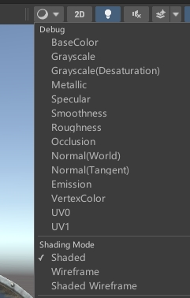

**Shaded**
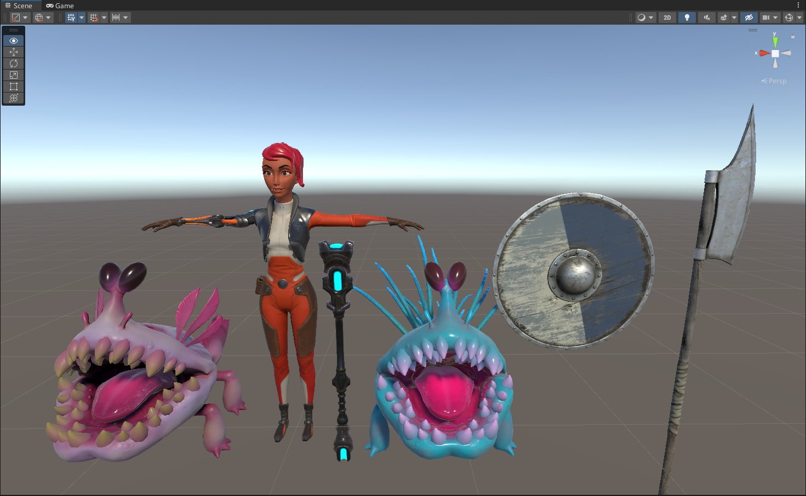

**BaseColor**
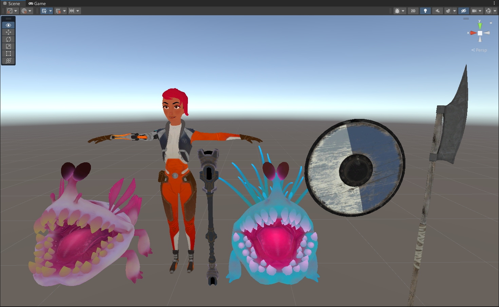

**Grayscale**
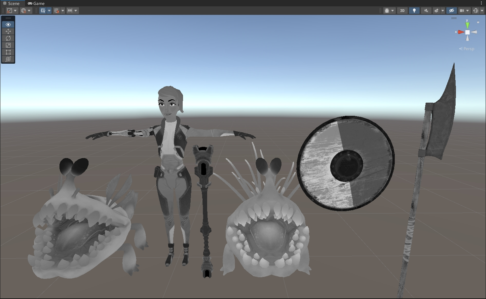

**Grayscale(Desaturation)**
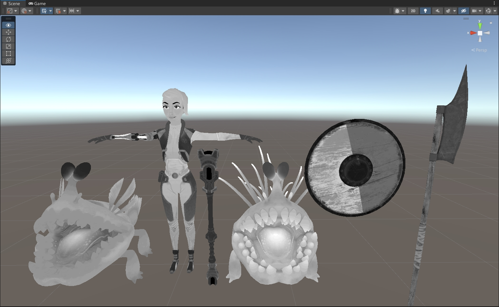

**Metallic**
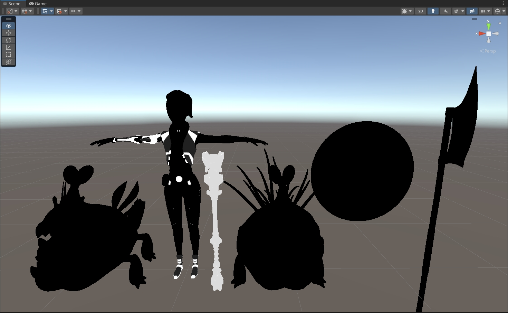

**Specular**
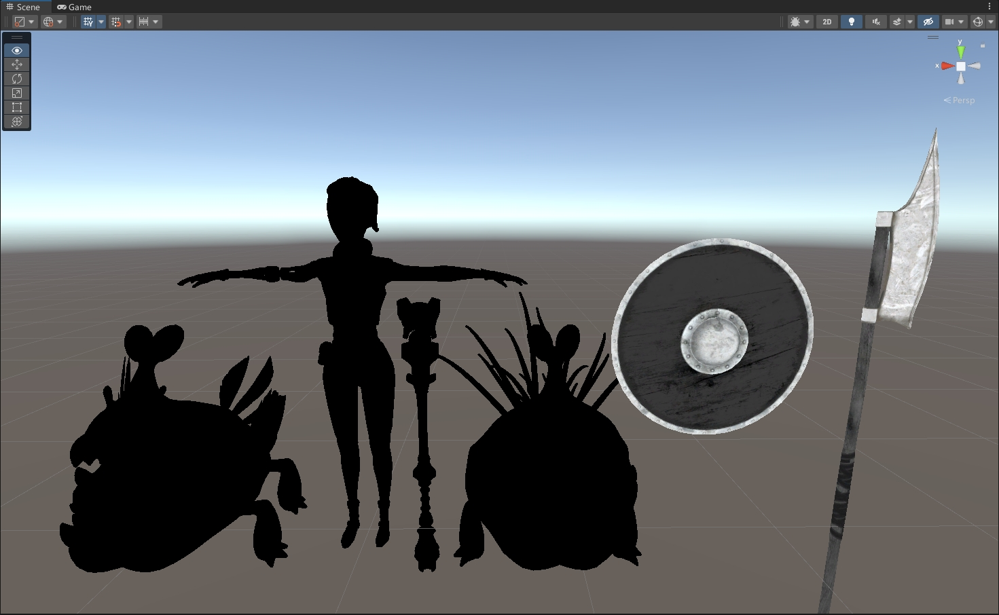

**Smoothness**
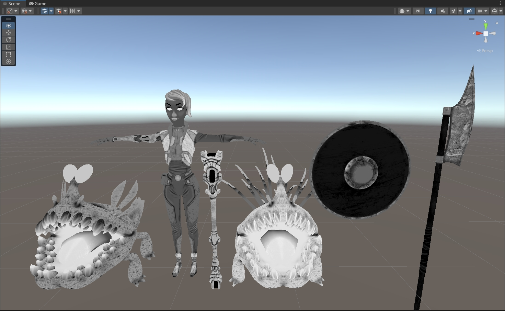

**Roughness**
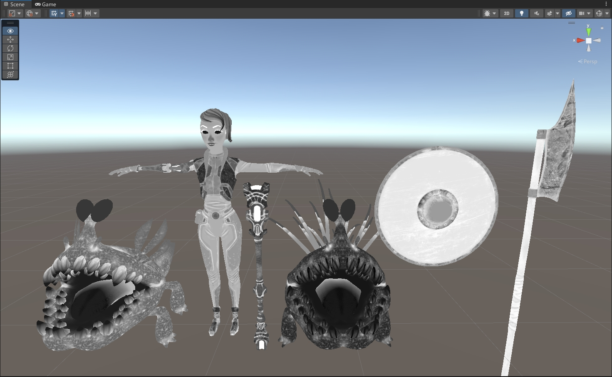

**Occlusion**
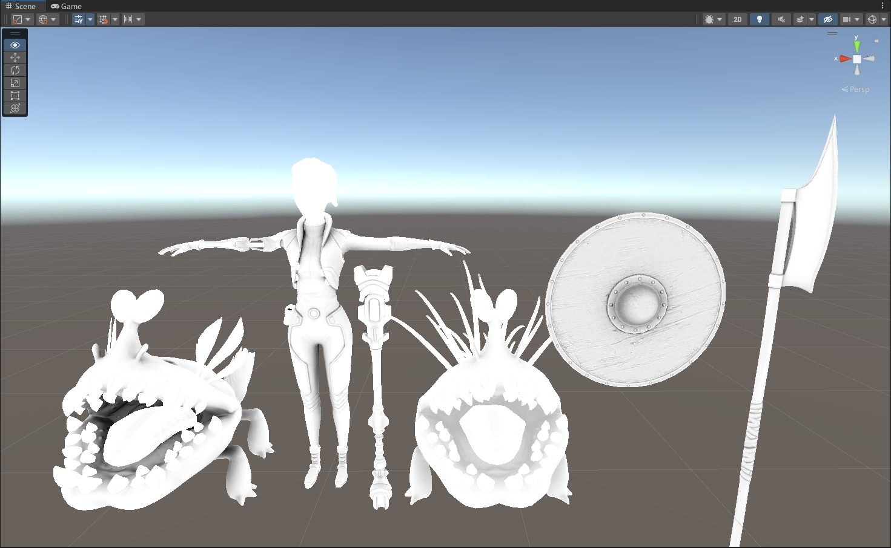

**Normal(World)**
.png)

**Normal(Tangent)**
.png)

**Emission**
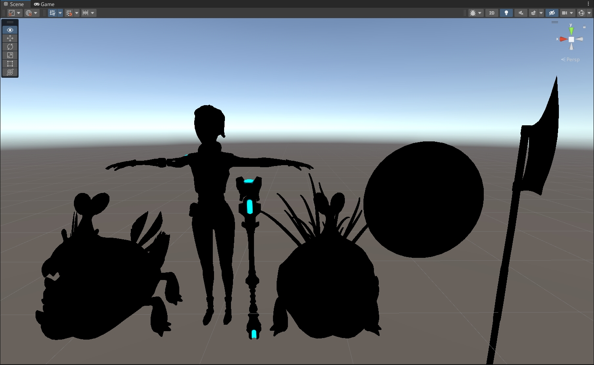

**VertexColor**
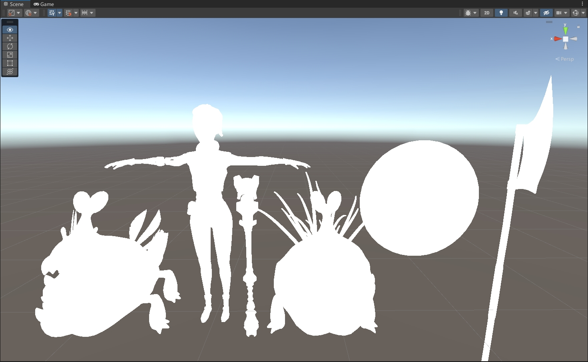

**UV0**
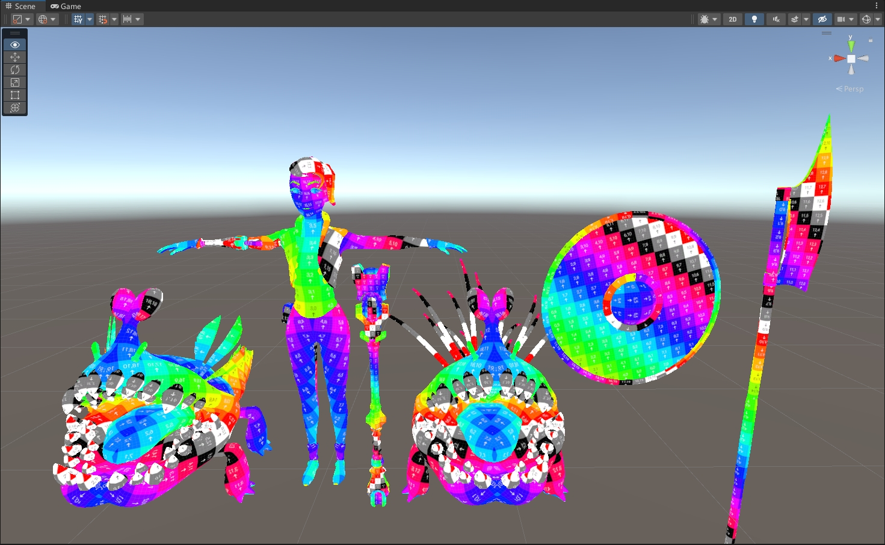

**UV1**
